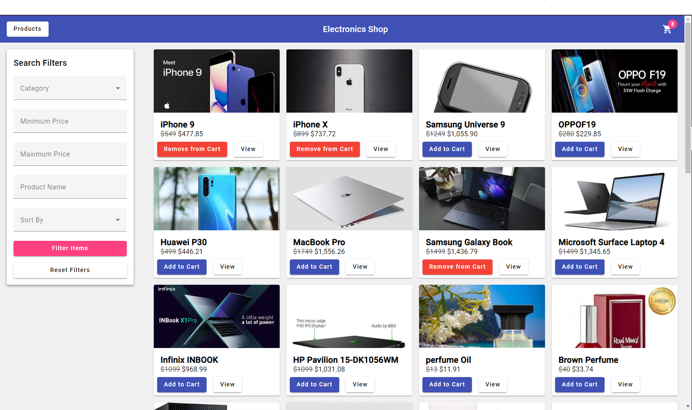
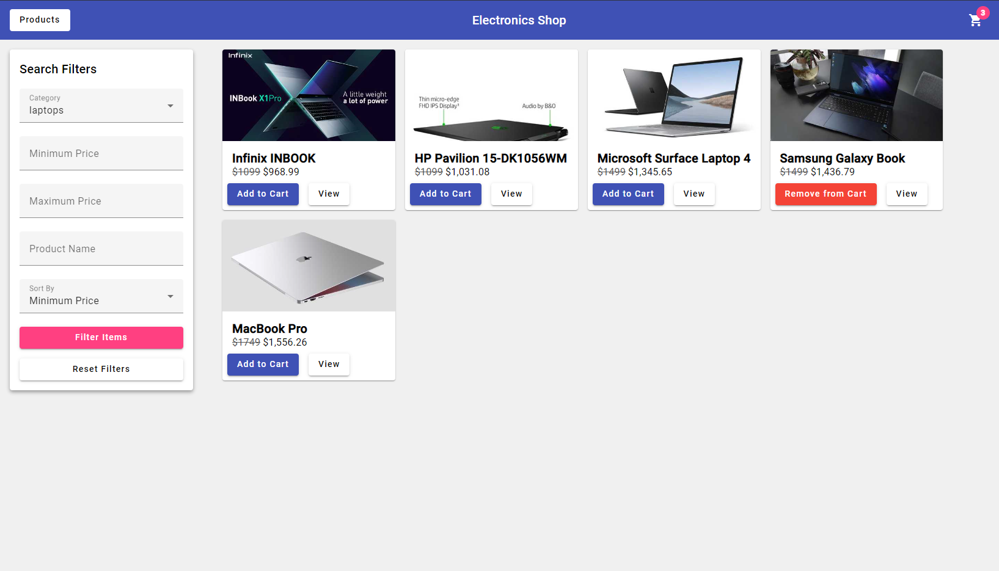
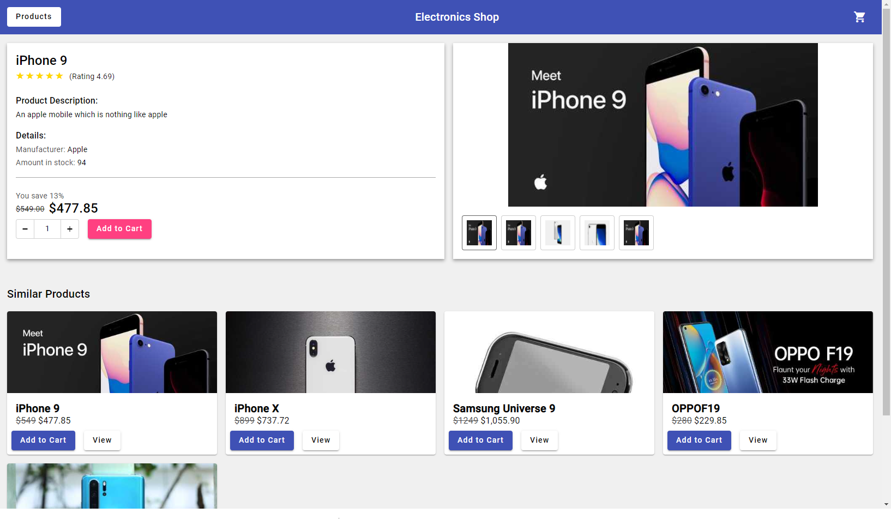
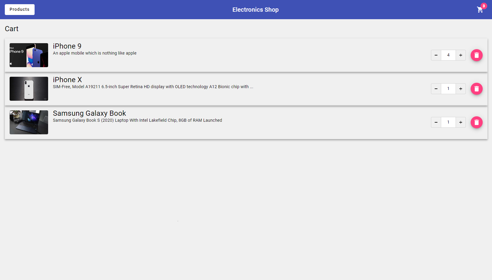

<h1 align="center">
  Shop Application
   
</h1>

  <a href="#key-features">Key Features</a> •
  <a href="#deployed-app">Deployed App</a> •
  <a href="#screenshots">Screenshots</a>

## Key Features

- Fetch products from REST API (https://dummyjson.com/docs/products)
- Product filters and sorting options
- NgRx state management
- Products Cart

## Deployed App

You can view the app here:
https://mintmissy.github.io/ShopApplication/

## Screenshots

Products page

Products page with applied filters

Individual Product Page

Cart Page

